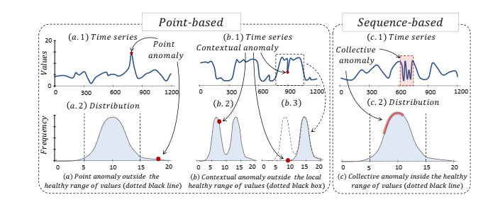

# Phát hiện điểm bất thường trong dữ liệu chuỗi thời gian

Những tiến bộ gần đây trong công nghệ thu thập dữ liệu, cùng với sự gia tăng không ngừng về khối lượng và tốc độ của dữ liệu dạng dòng (streaming data), đã khẳng định nhu cầu thiết yếu đối với các phương pháp phân tích chuỗi thời gian. Trong bối cảnh đó, việc phát hiện bất thường trong dữ liệu dạng chuỗi thời gian đã trở thành một hướng nghiên cứu quan trọng, với nhiều ứng dụng trong các lĩnh vực như an ninh mạng, thị trường tài chính, thực thi pháp luật và chăm sóc sức khỏe.

Trong khi các nghiên cứu truyền thống về phát hiện bất thường chủ yếu dựa trên các thước đo thống kê, sự gia tăng nhanh chóng của các thuật toán học máy trong những năm gần đây đã đặt ra nhu cầu xây dựng một khung đặc trưng hóa có hệ thống và tổng quát cho các phương pháp nghiên cứu trong phát hiện bất thường chuỗi thời gian. Bài khảo sát này tiến hành phân nhóm và tóm tắt các phương pháp phát hiện bất thường hiện có dựa trên một hệ phân loại theo hướng quy trình (process-centric taxonomy) trong bối cảnh chuỗi thời gian.

Bên cạnh việc đề xuất một cách phân loại mang tính hệ thống đối với các phương pháp phát hiện bất thường, nghiên cứu còn thực hiện một phân tích tổng hợp (meta-analysis) các công trình liên quan, đồng thời chỉ ra những xu hướng chung trong lĩnh vực phát hiện bất thường chuỗi thời gian.

# Giới thiệu

### Khái niệm điểm bất thường
Sự phát triển nhanh chóng về cả số lượng và ứng dụng thực tế của các cảm biến, mạng, lưu trữ và xử lý dữ liệu với chi phí hiệu quả đặt ra nhu cầu thu thập và lưu trữ một lượng khổng lồ các dữ liệu theo thời gian. Việc ghi lại các dữ liệu này tạo ra một chuỗi có thứ tự các điểm dữ liệu dạng số thực, thường được gọi là chuỗi thời gian (time series).
Việc phân tích trên dữ liệu chuỗi thời gian là nhu cầu cấp thiết trong hầu hết mọi ngành khoa học và các lĩnh vực công nghiệp. Tuy nhiên, sự phức tạp vốn có trong quá trình tạo dữ liệu của các hệ thống này, kết hợp với những sai sót trong hệ thống đo lường cũng như sự can thiệp của các tác nhân bên ngoài, thường dẫn đến những hiện tượng bất thường. Những sự kiện bất thường này sau đó xuất hiện trong dữ liệu thu thập được dưới dạng các anomaly (điểm bất thường).  Với thuật ngữ bất thường (anomalies), chúng ta đề cập đến các điểm dữ liệu hoặc nhóm các điểm dữ liệu không tuân theo một khái niệm nào đó về tính bình thường hoặc hành vi được kỳ vọng dựa trên dữ liệu đã quan sát trước đó.
Việc phát hiện bất thường trong chuỗi thời gian (time series) đã nhận được nhiều sự quan tâm trong cả học thuật và công nghiệp trong hơn sáu thập kỷ qua. Tùy thuộc vào ứng dụng, các bất thường có thể được phân loại thành
1. Nhiễu hoặc dữ liệu lỗi, gây cản trở quá trình phân tích dữ liệu;
2. Dữ liệu thực sự có giá trị cần quan tâm.

Trong trường hợp thứ nhất, các bất thường là dữ liệu không mong muốn và sẽ bị loại bỏ hoặc được chỉnh sửa. Trong trường hợp thứ hai, các bất thường có thể chỉ ra những sự kiện có ý nghĩa, chẳng hạn như sự cố hoặc sự thay đổi trong hành vi, là cơ sở cho các phân tích tiếp theo.

Chính vì vậy, việc phát hiện anomaly (bất thường) trong time series (chuỗi thời gian) mang lại rất nhiều lợi ích quan trọng, đặc biệt trong các hệ thống thực tế như IoT, tài chính, sản xuất, và y tế. 

Thứ nhất, việc phát hiện điểm bất thường giúp nhận diện các dấu hiệu bất thường trước khi sự cố nghiêm trọng xảy ra. Ví dụ như khi server có lưu lượng truy cập tăng đột biến, hệ thống phát hiện điểm bất thường sẽ phát cảnh báo có nguy cơ tấn công hoặc lỗi hệ thống. Việc phát hiện điểm bất thường lúc này sẽ giúp giảm chi phí downtime và chi phí sửa chữa.

Thứ hai, về mặt bảo trì, việc phát hiện các điểm bất thường giúp cho người vận hành hệ thống tránh khỏi việc bảo trì không cần thiết.

Đặc biệt, việc phát hiện gian lận trong những giao dịch ngân hàng hay thương mại điện tử cũng là một ứng dụng mang tính thực tiễn cao của những mô hình phát hiện điểm bất thường.

Để nhận biết những điểm bất thường, một số nhóm phương pháp đã và đang được nghiên cứu như sau.
- Nhóm các phương pháp đề xuất bước biến đổi (transformation) để chuyển thông tin thời gian sang một không gian vector phù hợp, sau đó áp dụng các kỹ thuật phát hiện outlier truyền thống bằng Machine Learning như XGBoost, Decision Tree, v.v.
- Một nhóm phương pháp khác sử dụng khoảng cách hoặc độ tương đồng chuyên biệt cho chuỗi thời gian để xác định các chuỗi thời gian hoặc các đoạn chuỗi bất thường.
- Nhóm các phương pháp thuộc cộng đồng deep learning tận dụng các kiến trúc mạng chuyên biệt có khả năng mã hóa thông tin thời gian, chẳng hạn như recurrent neural networks (RNN) hoặc các phương pháp dựa trên convolution.

### Phân loại điểm bất thường 

Do tính chất phụ thuộc theo thời gian của dữ liệu, các bất thường có thể xuất hiện dưới dạng một điểm đơn lẻ hoặc dưới dạng các chuỗi con. Trong bối cảnh bất thường điểm (point anomaly), mục tiêu là xác định các điểm dữ liệu nằm xa phân phối giá trị thông thường, vốn đại diện cho trạng thái hoạt động bình thường. Trong khi đó, đối với bất thường chuỗi (sequence anomaly), mục tiêu là phát hiện các chuỗi con bất thường; những chuỗi này thường không phải là các điểm ngoại lai riêng lẻ mà thể hiện các mẫu hiếm gặp và do đó mang tính bất thường. Trong các ứng dụng thực tế, việc phân biệt giữa bất thường điểm và bất thường chuỗi là đặc biệt quan trọng, bởi lẽ một điểm dữ liệu riêng lẻ có thể trông bình thường so với các điểm lân cận, nhưng hình dạng tổng thể của chuỗi các điểm đó lại có thể biểu hiện hành vi bất thường.

Về mặt hình thức, có thể phân loại bất thường trong chuỗi thời gian thành ba dạng chính: bất thường điểm (point anomalies), bất thường theo ngữ cảnh (contextual anomalies) và bất thường tập thể (collective anomalies).

* **Bất thường điểm (point anomalies)** là các điểm dữ liệu có sự sai lệch đáng kể so với phần còn lại của tập dữ liệu. Trong trường hợp này, giá trị của điểm bất thường nằm ngoài phạm vi giá trị bình thường kỳ vọng.

* **Bất thường theo ngữ cảnh (contextual anomalies)** là các điểm dữ liệu vẫn nằm trong phạm vi của phân phối tổng thể (khác với bất thường điểm), nhưng lại sai lệch so với phân phối kỳ vọng khi xét trong một ngữ cảnh cụ thể, chẳng hạn như trong một cửa sổ thời gian cục bộ.

* **Bất thường tập thể (collective anomalies)** là các chuỗi điểm dữ liệu không tuân theo các mẫu điển hình đã được quan sát trước đó, tức là biểu hiện các cấu trúc hoặc hành vi bất thường ở cấp độ chuỗi.

Hai loại đầu tiên, bao gồm bất thường điểm và bất thường theo ngữ cảnh, thường được gọi chung là **bất thường dựa trên điểm (point-based anomalies)**, trong khi bất thường tập thể được phân loại là **bất thường dựa trên chuỗi (sequence-based anomalies)**.

Ngoài ra, cần lưu ý một trường hợp khác của bài toán phát hiện bất thường chuỗi con, được gọi là **phát hiện bất thường trên toàn bộ chuỗi (whole-sequence detection)**, nhằm phân biệt với phát hiện bất thường tại từng điểm (point detection). Trong trường hợp này, chu kỳ của chuỗi con tương ứng với toàn bộ chuỗi thời gian, và toàn bộ chuỗi được xem xét như một thực thể thống nhất để đánh giá tính bất thường.

Cách tiếp cận này thường xuất hiện trong các bài toán làm sạch dữ liệu cảm biến, nơi các nhà nghiên cứu quan tâm đến việc xác định một cảm biến hoạt động bất thường trong số nhiều cảm biến đang vận hành bình thường.

# Các phương pháp nhận biết điểm bất thường
<h1>Các phương pháp nhận biết điểm bất thường</h1>

<table border="1" cellspacing="0" cellpadding="8">
  <thead>
    <tr>
      <th>Nhóm phương pháp</th>
      <th>Hướng tiếp cận</th>
      <th>Các mô hình</th>
      <th>Ưu điểm</th>
      <th>Nhược điểm</th>
      <th>Ứng dụng</th>
    </tr>
  </thead>
  <tbody>
    <tr>
      <td rowspan="3">1. Khoảng cách (Distance-based)</td>
      <td>Mức độ lân cận: điểm cô lập với hàng xóm</td>
      <td>KNN, LOF</td>
      <td rowspan="3">Giữ nguyên bản dữ liệu, dễ triển khai</td>
      <td rowspan="3">Gặp khó khăn nếu các điểm bất thường co cụm lại với nhau</td>
      <td rowspan="3">Chủ yếu dùng trong học unsupervised, dữ liệu không nhãn, tìm điểm nằm ngoài phân phối</td>
    </tr>
    <tr>
      <td>Phân cụm: không thuộc cụm nào / xa tâm</td>
      <td>K-means, DBSCAN, MCOD</td>
    </tr>
    <tr>
      <td>Sự bất đồng: chuỗi con xa điểm lân cận nhất</td>
      <td>Matrix Profile, HOT SAX, DAD</td>
    </tr>

    <tr>
      <td rowspan="4">2. Mật độ / Cấu trúc (Density-based)</td>
      <td>Phân phối: dùng đặc trưng thống kê</td>
      <td>MCD, OCSVM, HBOS</td>
      <td rowspan="4">Bắt được các điểm phức tạp, có tính chu kỳ hoặc cấu trúc liên kết</td>
      <td rowspan="4">Tiền xử lý phức tạp, đòi hỏi biểu diễn dữ liệu chính xác</td>
      <td rowspan="4">Hiệu quả với dữ liệu nhiễu, chuỗi thời gian đa biến, thiết lập semi-supervised</td>
    </tr>
    <tr>
      <td>Đồ thị: xét đường đi / bậc nút bất thường</td>
      <td>FSM, Series2Graph</td>
    </tr>
    <tr>
      <td>Dạng cây: điểm bị cô lập ở node thấp</td>
      <td>Isolation Forest (IForest)</td>
    </tr>
    <tr>
      <td>Mã hóa: nén dữ liệu và so sánh độ khớp</td>
      <td>PCA, GrammarViz, HMM</td>
    </tr>

    <tr>
      <td rowspan="2">3. Dự đoán (Prediction-based)</td>
      <td>Dự báo (Forecasting): học quá khứ để dự đoán tương lai, bất thường = sai số lớn</td>
      <td>Exponential Smoothing, OceanWNN, NoveltySVR</td>
      <td rowspan="2">Rất mạnh mẽ trong nhận diện các biến động chệch hướng hoàn toàn so với xu hướng chung</td>
      <td rowspan="2">Yêu cầu tập dữ liệu huấn luyện đủ tốt</td>
      <td rowspan="2">Phân tích chuỗi thời gian phức tạp, đánh giá sai lệch / lỗi tái thiết</td>
    </tr>
    <tr>
      <td>Tái thiết (Reconstruction): nén và giải mã chuỗi, bất thường = lỗi tái thiết cao</td>
      <td>Autoencoder (LSTM-VAE, DONUT, OmniAnomaly...), GAN (MAD-GAN, VAE-GAN...)</td>
    </tr>
  </tbody>
</table>

# Phương pháp đề xuất (Proposed Method)
### K-Nearest Neighbors (KNN) - Phương pháp dựa trên khoảng cách

Khái niệm: Theo Chandola et al. (2009), các kỹ thuật dựa trên khoảng
cách (distance-based) hoạt động trên một giả định cốt lõi: "Các điểm dữ
liệu bình thường có khu vực lân cận dày đặc (dense neighborhoods), trong
khi các điểm bất thường nằm cách xa các hàng xóm gần nhất của chúng."
Thuật toán KNN mô hình hóa không gian dữ liệu bằng cách tính toán khoảng
cách (ví dụ: khoảng cách Euclidean) từ một điểm dữ liệu bất kỳ đến $k$
điểm lân cận gần nhất của nó.

Vai trò sử dụng: Trong bài toán phát hiện bất thường, KNN không được
dùng để dự đoán nhãn lớp (classification) mà để tính toán điểm số bất
thường (anomaly score). Điểm số này thường chính là khoảng cách từ một
điểm đến hàng xóm thứ $k$ của nó, hoặc khoảng cách trung bình đến $k$
hàng xóm. Các mẫu dữ liệu (ví dụ: các giao dịch) có khoảng cách này vượt
quá một ngưỡng giới hạn sẽ được xác định là các điểm dị thường mang tính
cục bộ (local outliers).

### K-means Clustering - Phương pháp dựa trên phân cụm

Khái niệm: Bài báo tổng quan định nghĩa phương pháp dựa trên phân cụm
(clustering-based) tuân theo giả định: "Dữ liệu bình thường thuộc về các
cụm lớn và dày đặc trong không gian dữ liệu, trong khi các điểm bất
thường không thuộc về bất kỳ cụm nào, hoặc thuộc về các cụm có kích
thước rất nhỏ, hoặc nằm rất xa tâm của cụm gần nhất." K-means là thuật
toán học không giám sát tiêu biểu, làm nhiệm vụ phân chia tập dữ liệu
thành $k$ cụm phân biệt thông qua việc tối ưu hóa vị trí của các tâm cụm
(centroids).

Vai trò sử dụng: K-means đóng vai trò thiết lập bức tranh cấu trúc tổng
thể của dữ liệu bình thường. Quá trình phát hiện bất thường diễn ra ở
giai đoạn hậu phân cụm: một điểm dữ liệu mới sẽ được gán điểm số bất
thường tỷ lệ thuận với khoảng cách từ nó đến tâm cụm gần nhất. K-means
đặc biệt hiệu quả trong việc xử lý các tập dữ liệu lớn để nhanh chóng
bóc tách những nhóm hành vi chệch hướng hoàn toàn so với quần thể chung
(global outliers).
